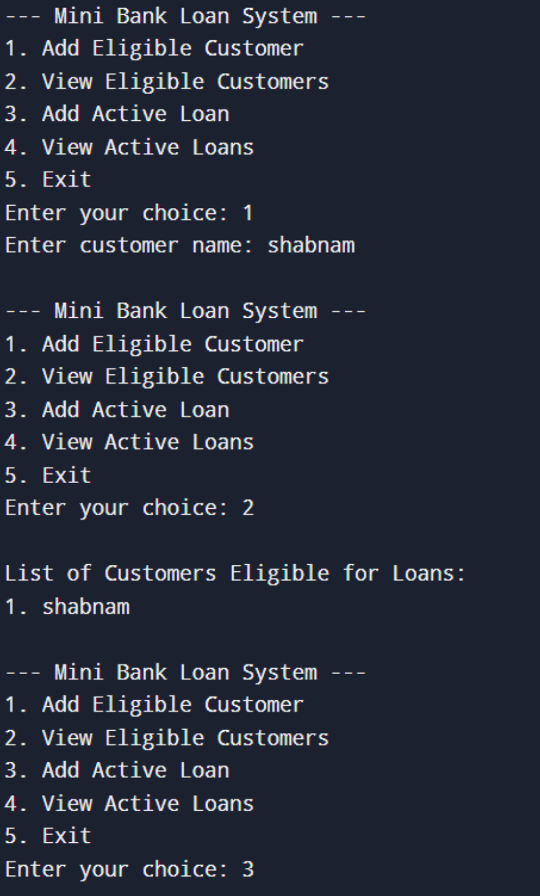
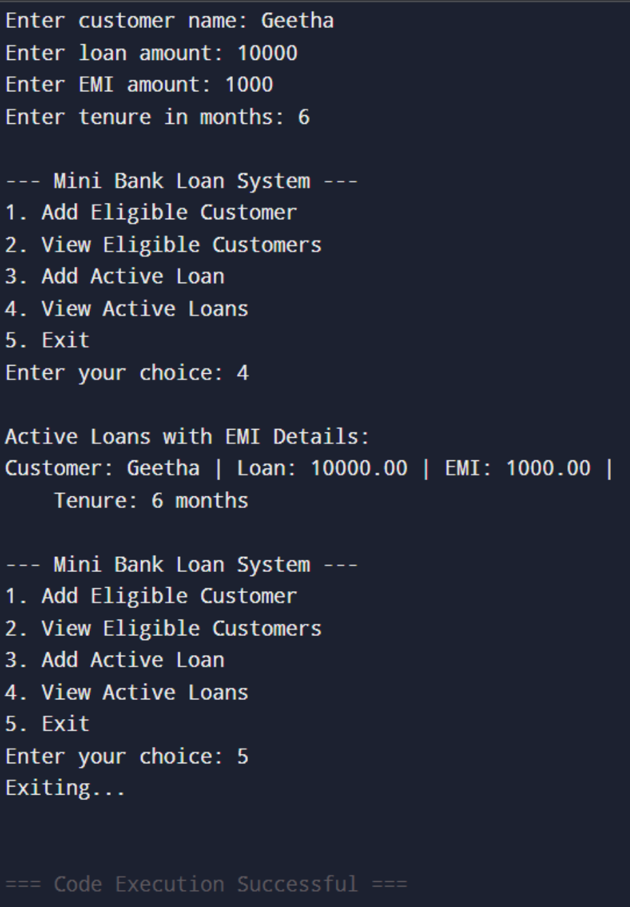

# 💰 Mini Bank Loan System in C 💻

Welcome to the **Mini Bank Loan System** — a simple yet functional C program that handles:
- ✅ Adding & Displaying Eligible Customers
- 🏦 Managing Active Loans with EMI Details using Linked Lists

---

## 📂 Project Description

This command-line banking simulation project allows users to:
- Add **eligible customers** (stored in an array)
- Maintain a list of **active loans** (stored in a linked list)
- Display the customer and loan data interactively via a menu-driven system

---

## 📸 Output Screenshots

| Eligible Customers | Active Loans |
|--------------------|--------------|
|  |  |

---

## 📝 Documentation & Presentation

- 📄 [View Word Document with Source Code & Explanation](project.docx)
- 📊 [View PPT Presentation of the Source Code (PDF)](ppt%20mbls%20.pdf)

---

## 🛠 Features

- 🧑 Add Eligible Customers
- 📋 Display List of Eligible Customers
- ➕ Add Loans with EMI & Tenure
- 📄 Display Active Loan Information

---

## 🧠 Concepts Used

- Arrays for storing eligible customers
- Linked List for dynamic loan entries
- String handling in C
- Menu-driven interface using loops and switch-case

---

## 🚀 How to Run

1. Copy the source code into a file, e.g., `MiniBank.c`
2. Compile the code:
   ```bash
   gcc loan_system.c -o MiniBank

3. Run the program:

   ```bash
   ./MiniBank
   ```

⭐ *Star this repo if you found it useful!*


